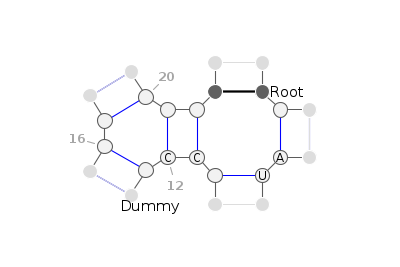

In VARNA API, we offer three Python classes [VARNA](#varnaapi.VARNA), [Comparison](#varnaapi.Comparison), and [Motif](#varnaapi.Motif) for RNA secondary structure visualisation.
The first two correspond to the classic and the comparison mode in VARNA. The last one is the special case for motif drawing.
Both [Comparison](#varnaapi.Comparison) and [Motif](#varnaapi.Motif) are inherited classes of [VARNA](#varnaapi.VARNA).

::: varnaapi
    selection:
      members: ["VARNA"]

::: varnaapi
    selection:
      members: ["Comparison"]

::: varnaapi
    selection:
      filters: ["!savefig"]
      members: ["Motif"]



<figcaption>Motif ((*)(*)(((*)(*))))</figcaption>

### Example
Figure above is created with
```python
from varnaapi import Motif, BaseAnnotation
m = Motif("((*)(*)(((*)(*))))", sequence="  *AU* CC *  *    ")
m.add_annotation(BaseAnnotation(" Root", 1))
m.add_annotation(BaseAnnotation("Dummy", 13))
# Show how base indices work for motif.
# Remeber that VARNA is 1-indexed
m.set_default_color(baseNum="#a6a6a6")
m.set_numeric_params(periodNum=4)
m.savefig("motif_ex.png")
```
